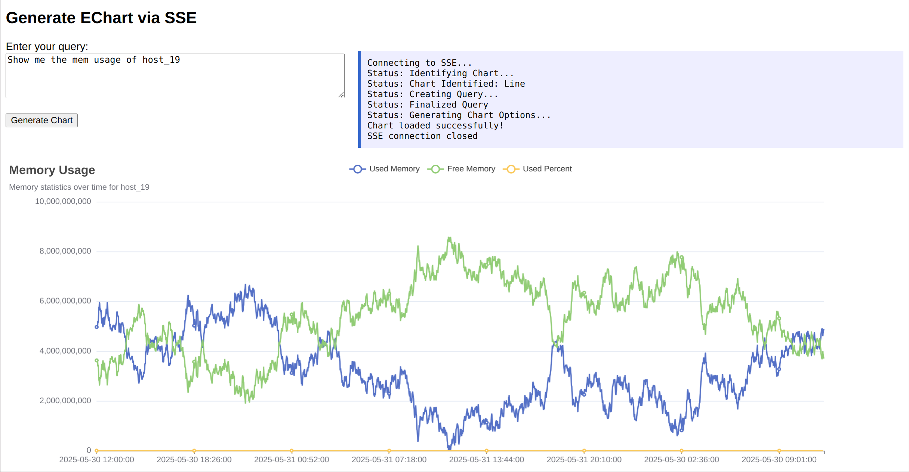

# AI Echart Generator
Echarts is one of the popular opensource library for graph and other types of visualization.

This application helps to create the echarts `option` dynamically based on the data available in the SQL database.

It uses AI to convert your SQL data in Echart options.

You can create stunning graphs using the normal chat interaction.

For now line, bar and pie charts are available. You can add more chart types in the `chart_agents.py` file.

This application now uses two different LLMs to get the job done.
- Llama3 (Chart identification and other small task).
- OpenAI(SQL Interaction and Echart Option generation).

This application has SSE endpoint. So after each step completion in workflow you will receive response from backend.

## Architecture
index.html -> Flask API(SSE) -> Workflow

#### Workflow
1. Chart Identification
2. SQL Query Creation
3. Extract AI created query from its markdown format (safeguard)
4. Create code that can generate echart options/graph

#### Adding additional agent.
- You can add your new agent in chart_agents.py
- Include that agent in your workflow/flow.py
- AgentFactory helps you to create the agents easily and consistent across the application.

This repo also contains echart-scrapper under util folder. Incase if you want to scrape the echart and feed the model with the sample data you can use it.

Sample Output:

This is just an initial model/phase1. Still needs to be improved.